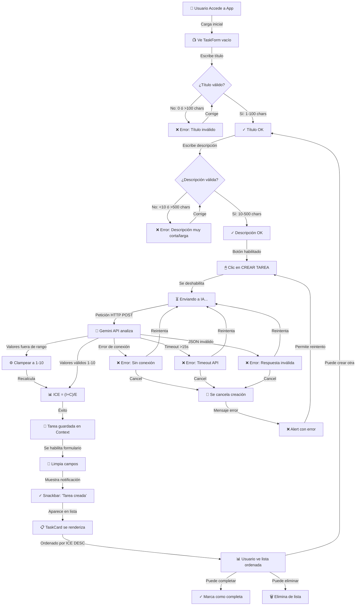
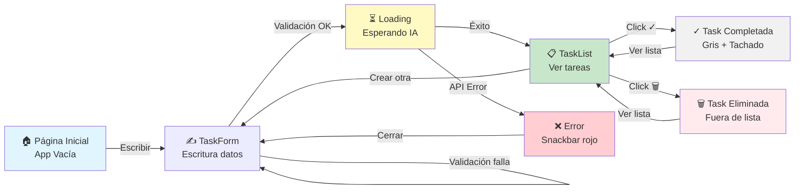

# 🎨 Diseño UX/UI: Gestor de Tareas ICE
## Flujo de Usuario, Jerarquía de Pantallas y Componentes MUI

**Versión**: 1.0  
**Fecha**: Mayo 2026  
**Diseño**: Material UI para React  
**Enfoque**: MVP Simple y Educativo

---

## 📱 Resumen Ejecutivo

La aplicación "Gestor de Tareas Inteligente" es una **interfaz de una sola página (SPA)** donde el usuario puede:
1. **Crear tareas** con título y descripción
2. **Recibir evaluación ICE automática** desde IA
3. **Gestionar tareas** (completar, eliminar)
4. **Ver priorización inteligente** basada en puntaje ICE

**Duración esperada del flujo**: ~30 segundos (crear tarea + esperar IA)

---

## 👤 Flujo de Usuario Principal

### Paso a Paso: Desde Entrada hasta Tarea Confirmada

```
┌─────────────────────────────────────────────────────────────────┐
│ 1. USUARIO ACCEDE A LA APP                                      │
│    ↓ Carga página / App.tsx                                      │
│    ↓ Ve interfaz vacía con formulario                            │
└─────────────────────────────────────────────────────────────────┘
                              ↓
┌─────────────────────────────────────────────────────────────────┐
│ 2. COMPLETA FORMULARIO (TaskForm)                               │
│    • Campo de Título (placeholder: "Ej: Implementar auth")      │
│    • Campo de Descripción (placeholder: "Describe la tarea")    │
│    • Campo oculto: Prioridad (auto-generada por IA)             │
│    • Validación en tiempo real:                                 │
│      - Título: 1-100 caracteres ✓/✗                            │
│      - Descripción: 10-500 caracteres ✓/✗                      │
│      - Botón "Crear" deshabilitado si hay errores               │
└─────────────────────────────────────────────────────────────────┘
                              ↓
┌─────────────────────────────────────────────────────────────────┐
│ 3. HACE CLIC EN "CREAR TAREA"                                   │
│    ↓ Se deshabilita botón                                        │
│    ↓ Aparece spinner de carga (CircularProgress MUI)            │
│    ↓ Envío POST a API de Gemini con descripción                │
└─────────────────────────────────────────────────────────────────┘
                              ↓
┌─────────────────────────────────────────────────────────────────┐
│ 4. IA PROCESA LA TAREA (~2-3 segundos)                          │
│    ↓ API Gemini analiza descripción                             │
│    ↓ Retorna JSON: {impacto: 8, confianza: 7, esfuerzo: 4}    │
│    ↓ Se calcula: ICE = (8+7)/4 = 3.75                          │
└─────────────────────────────────────────────────────────────────┘
                              ↓
┌─────────────────────────────────────────────────────────────────┐
│ 5. TAREA APARECE EN LA LISTA (TaskList → TaskCard)              │
│    ┌─────────────────────────────────────────────────┐          │
│    │ 🎯 Implementar autenticación                     │ ← Título│
│    │ Crear sistema OAuth con Google y GitHub         │ ← Desc  │
│    │                                                  │          │
│    │ Impacto: 8/10 | Confianza: 7/10 | Esfuerzo: 4  │ ← ICE   │
│    │ 📊 Puntaje ICE: 3.75 (ALTO)                     │ ← Score │
│    │                                                  │          │
│    │ ✓ Completar    🗑 Eliminar                       │ ← Acciones
│    └─────────────────────────────────────────────────┘          │
│                                                                  │
│    • Card con ícono de prioridad (color según ICE):            │
│      - 🟢 Verde (ICE > 2.0) = Alta prioridad                   │
│      - 🟡 Amarillo (1.0-2.0) = Media prioridad                 │
│      - 🔴 Rojo (< 1.0) = Baja prioridad                        │
│                                                                  │
│    • Formulario se limpia para nueva tarea                      │
│    • Notificación Snackbar: "✓ Tarea creada exitosamente"     │
└─────────────────────────────────────────────────────────────────┘
                              ↓
┌─────────────────────────────────────────────────────────────────┐
│ 6. USUARIO VE LISTA ORDENADA POR ICE (DESC)                    │
│    • Tareas con ICE alto arriba                                 │
│    • Tareas con ICE bajo abajo                                  │
│    • Cada tarea es interactiva                                  │
└─────────────────────────────────────────────────────────────────┘
                              ↓
┌─────────────────────────────────────────────────────────────────┐
│ 7. USUARIO PUEDE (Estados finales):                             │
│    A) Completar tarea → Se marca como ✓ (gris, tachado)       │
│    B) Eliminar tarea → Se quita de la lista                    │
│    C) Crear más tareas → Vuelve a paso 2                       │
└─────────────────────────────────────────────────────────────────┘
```

---

## 🗺️ Jerarquía de Pantallas y Componentes

```
┌──────────────────────────────────────────────────────────────┐
│                        APP (Pantalla Única)                  │
│                                                              │
│  ┌────────────────────────────────────────────────────────┐ │
│  │ NAVBAR (Fijo Arriba)                                   │ │
│  │ ┌──────────────────────────────────────────────────┐   │ │
│  │ │ 🎯 Gestor de Tareas Inteligente | ℹ️ Ayuda      │   │ │
│  │ └──────────────────────────────────────────────────┘   │ │
│  └────────────────────────────────────────────────────────┘ │
│                                                              │
│  ┌────────────────────────────────────────────────────────┐ │
│  │ MAIN CONTENT (Scrolleable)                             │ │
│  │                                                         │ │
│  │  ┌─────────────────────────────────────────────────┐  │ │
│  │  │ TASK FORM SECTION                               │  │ │
│  │  │ ┌───────────────────────────────────────────────┤  │ │
│  │  │ │ ✍️ Crear Nueva Tarea                          │  │ │
│  │  │ │                                               │  │ │
│  │  │ │ [TextField] Título                           │  │ │
│  │  │ │ "Ej: Implementar autenticación..."           │  │ │
│  │  │ │ 0/100 caracteres                             │  │ │
│  │  │ │                                               │  │ │
│  │  │ │ [TextField Multiline] Descripción             │  │ │
│  │  │ │ "Describe brevemente el trabajo a realizar"  │  │ │
│  │  │ │ 0/500 caracteres ⚠️ Mínimo 10 caracteres    │  │ │
│  │  │ │                                               │  │ │
│  │  │ │ [Button Primary] CREAR TAREA                 │  │ │
│  │  │ │ (Deshabilitado si hay errores)               │  │ │
│  │  │ └───────────────────────────────────────────────┤  │ │
│  │  └─────────────────────────────────────────────────┘  │ │
│  │                                                         │ │
│  │  ┌─────────────────────────────────────────────────┐  │ │
│  │  │ TASK LIST SECTION                               │  │ │
│  │  │ ┌───────────────────────────────────────────────┤  │ │
│  │  │ │ 📋 Tareas ({count})                          │  │ │
│  │  │ │ [Tabs] Todas | ✓ Completadas | ⏳ Pendientes│  │ │
│  │  │ │                                               │  │ │
│  │  │ │ ┌─────────────────────────────────────────┐  │  │ │
│  │  │ │ │ TASK CARD #1                            │  │  │ │
│  │  │ │ │ ┌─────────────────────────────────────┐ │  │  │ │
│  │  │ │ │ │ 🎯 Implementar OAuth               │ │  │  │ │
│  │  │ │ │ │ Crear sistema de autenticación...   │ │  │  │ │
│  │  │ │ │ │                                     │ │  │  │ │
│  │  │ │ │ │ 📊 ICE SCORE                        │ │  │  │ │
│  │  │ │ │ │ ┌─────────────────────────────────┐ │ │  │  │ │
│  │  │ │ │ │ │ Impacto:   8/10 [████████░░]   │ │ │  │  │ │
│  │  │ │ │ │ │ Confianza: 7/10 [███████░░░]   │ │ │  │  │ │
│  │  │ │ │ │ │ Esfuerzo:  4/10 [████░░░░░░]   │ │ │  │  │ │
│  │  │ │ │ │ │ TOTAL ICE: 3.75 🟢 (ALTO)      │ │ │  │  │ │
│  │  │ │ │ │ └─────────────────────────────────┘ │ │  │  │ │
│  │  │ │ │ │                                     │ │  │  │ │
│  │  │ │ │ │ [✓ Completar] [🗑 Eliminar]      │ │  │  │ │
│  │  │ │ │ └─────────────────────────────────┘ │ │  │  │ │
│  │  │ │ │                                       │ │  │  │ │
│  │  │ │ │ TASK CARD #2, #3... (más tareas)    │ │  │  │ │
│  │  │ │ │                                       │ │  │  │ │
│  │  │ │ │ [Mensaje vacío si no hay tareas]    │ │  │  │ │
│  │  │ │ └───────────────────────────────────┘  │  │  │ │
│  │  │ └───────────────────────────────────────────┤  │ │
│  │  └─────────────────────────────────────────────┘  │ │
│  │                                                         │ │
│  └────────────────────────────────────────────────────────┘ │
│                                                              │
│  ┌────────────────────────────────────────────────────────┐ │
│  │ FOOTER OPCIONAL                                        │ │
│  │ [Button] Limpiar todas las tareas (para resetear)     │ │
│  └────────────────────────────────────────────────────────┘ │
│                                                              │
│ MODAL OVERLAY (cuando hay error o loading)                  │
│ ┌────────────────────────────────────────────────────────┐ │
│ │ SNACKBAR (Esquina inferior derecha, temporal)          │ │
│ │ ✓ "Tarea creada exitosamente"                          │ │
│ │ ✗ "Error: No se pudo obtener ICE. Intenta más tarde"  │ │
│ └────────────────────────────────────────────────────────┘ │
└──────────────────────────────────────────────────────────────┘
```

---

## 🔄 Diagrama de Flujo: Proceso de Crear Tareas



---

## 🧭 Diagrama de Flujo: Navegación del Usuario



---

## 🎨 Componentes MUI Utilizados por Pantalla

### **1. NAVBAR (AppBar + Toolbar)**

```
┌────────────────────────────────────────────────────────────┐
│  📱 AppBar (MUI)                                           │
│  ├─ Toolbar (contenedor flexible)                         │
│  │  ├─ Typography (h6) "🎯 Gestor de Tareas"             │
│  │  ├─ Box (flex: 1) - espaciador                        │
│  │  ├─ IconButton + Tooltip "ℹ️ Ayuda"                   │
│  │  └─ IconButton + Menu "⋮ Más opciones"                │
│  └─ Props: color="primary", elevation={4}                │
└────────────────────────────────────────────────────────────┘
```

**Componentes MUI**: `AppBar`, `Toolbar`, `Typography`, `IconButton`, `Tooltip`, `Menu`

---

### **2. TASK FORM (Form Input Section)**

```
┌────────────────────────────────────────────────────────────┐
│  📄 Paper / Card (MUI)                                     │
│  ├─ CardHeader: "✍️ Crear Nueva Tarea"                   │
│  ├─ CardContent:                                          │
│  │  ├─ TextField (outlined, fullWidth)                    │
│  │  │  ├─ label="Título"                                 │
│  │  │  ├─ placeholder="Ej: Implementar autenticación"   │
│  │  │  ├─ error={titleError}                            │
│  │  │  ├─ helperText={titleError}                       │
│  │  │  └─ onChange={handleTitleChange}                  │
│  │  │                                                    │
│  │  ├─ Box sx={{ mt: 2 }}                              │
│  │  │  ├─ TextField (multiline, rows=4)                 │
│  │  │  │  ├─ label="Descripción"                        │
│  │  │  │  ├─ placeholder="Describe brevemente..."       │
│  │  │  │  ├─ error={descError}                          │
│  │  │  │  ├─ helperText={descError}                     │
│  │  │  │  └─ onChange={handleDescChange}                │
│  │  │                                                    │
│  │  ├─ Box sx={{ display: 'flex', gap: 1, mt: 2 }}    │
│  │  │  ├─ Button (variant="contained", fullWidth)       │
│  │  │  │  ├─ startIcon={<AddCircleOutlineIcon />}      │
│  │  │  │  ├─ disabled={!isFormValid || isLoading}       │
│  │  │  │  └─ onClick={handleSubmit}                     │
│  │  │  │     "CREAR TAREA"                              │
│  │  │  │                                                │
│  │  │  └─ Button (variant="outlined")                   │
│  │  │     "LIMPIAR"                                     │
│  │  │                                                    │
│  │  └─ LinearProgress (sx={{ mt: 2 }})                  │
│  │     (Mostrar solo si isLoading)                      │
│  │     variant="determinate" / "indeterminate"          │
│  │                                                       │
│  └─ CardActions: [Botones info/ayuda opcional]          │
└────────────────────────────────────────────────────────────┘
```

**Componentes MUI**: `Card`, `CardHeader`, `CardContent`, `CardActions`, `TextField`, `Button`, `Box`, `LinearProgress`, `InputAdornment`

---

### **3. TASK LIST (Contenedor de Tareas)**

```
┌────────────────────────────────────────────────────────────┐
│  📋 Paper / Section (MUI)                                  │
│  ├─ Box sx={{ p: 2 }}                                    │
│  │  ├─ Typography (variant="h5") "Tareas ({count})"      │
│  │  ├─ Divider (sx={{ my: 2 }})                         │
│  │  │                                                    │
│  │  ├─ Tabs (MUI TabPanel opcional)                      │
│  │  │  ├─ Tab "📋 Todas"                               │
│  │  │  ├─ Tab "✓ Completadas"                          │
│  │  │  └─ Tab "⏳ Pendientes"                           │
│  │  │                                                    │
│  │  ├─ Stack (spacing={2}, sx={{ mt: 2 }})            │
│  │  │  │                                                │
│  │  │  ├─ [TaskCard #1]                                │
│  │  │  ├─ [TaskCard #2]                                │
│  │  │  ├─ [TaskCard #3]                                │
│  │  │  └─ ...                                           │
│  │  │                                                    │
│  │  └─ Alert (variant="info", sx={{ mt: 2 }})          │
│  │     (Mostrar si no hay tareas)                       │
│  │     "No tienes tareas. ¡Crea una!"                   │
│  │                                                       │
│  └─ Pagination (opcional, MUI Pagination)              │
│     (Solo si hay muchas tareas)                         │
└────────────────────────────────────────────────────────────┘
```

**Componentes MUI**: `Paper`, `Box`, `Typography`, `Divider`, `Tabs`, `TabPanel`, `Stack`, `Alert`, `Pagination`

---

### **4. TASK CARD (Tarjeta Individual)**

```
┌──────────────────────────────────────────────────────────┐
│ 🎴 Card (MUI)                                            │
│ ├─ CardHeader:                                           │
│ │  ├─ avatar={<Chip icon={getPriorityIcon()} />}       │
│ │  │  (Ícono según ICE: 🟢/🟡/🔴)                     │
│ │  ├─ title={task.title}                               │
│ │  └─ subheader={formatDate(task.createdAt)}           │
│ │                                                       │
│ ├─ CardContent:                                         │
│ │  ├─ Typography (variant="body2", color="textSecondary")
│ │  │  {task.description}                               │
│ │  │                                                   │
│ │  ├─ Box sx={{ mt: 2 }}>                             │
│ │  │  ├─ Paper (sx={{ p: 2, bgcolor: '#f5f5f5' }})   │
│ │  │  │  ├─ Typography (variant="subtitle2")          │
│ │  │  │  │  "📊 Puntaje ICE"                         │
│ │  │  │  │                                            │
│ │  │  │  ├─ Box sx={{ mt: 1, display: 'flex', gap: 2 }} │
│ │  │  │  │  │                                         │
│ │  │  │  │  ├─ Box (flex: 1)                         │
│ │  │  │  │  │  ├─ Typography (variant="caption")     │
│ │  │  │  │  │  │  "Impacto: 8/10"                    │
│ │  │  │  │  │  └─ LinearProgress (value=80)          │
│ │  │  │  │  │                                         │
│ │  │  │  │  ├─ Box (flex: 1)                         │
│ │  │  │  │  │  ├─ Typography (variant="caption")     │
│ │  │  │  │  │  │  "Confianza: 7/10"                  │
│ │  │  │  │  │  └─ LinearProgress (value=70)          │
│ │  │  │  │  │                                         │
│ │  │  │  │  └─ Box (flex: 1)                         │
│ │  │  │  │     ├─ Typography (variant="caption")     │
│ │  │  │  │     │  "Esfuerzo: 4/10"                   │
│ │  │  │  │     └─ LinearProgress (value=40)          │
│ │  │  │  │                                            │
│ │  │  │  ├─ Divider (sx={{ my: 1.5 }})              │
│ │  │  │  │                                            │
│ │  │  │  ├─ Box sx={{ display: 'flex', alignItems: 'center', gap: 1 }}
│ │  │  │  │  ├─ Typography (variant="h6", color="primary")
│ │  │  │  │  │  "ICE Total:"                          │
│ │  │  │  │  └─ Chip (label="3.75", color="primary", variant="outlined",
│ │  │  │  │           icon={getPriorityIcon()})       │
│ │  │  │  │     label="ALTO" / "MEDIO" / "BAJO"      │
│ │  │  │  │                                            │
│ │  │  │  └─ Typography (variant="caption", sx={{ mt: 1, fontStyle: 'italic' }})
│ │  │  │     "Evaluación de IA - Creada: 2m ago"      │
│ │  │                                                  │
│ ├─ CardActions:                                        │
│ │  ├─ Button (variant="outlined", size="small")       │
│ │  │  startIcon={<CheckCircleOutline />}             │
│ │  │  onClick={handleComplete}                        │
│ │  │  "COMPLETAR"                                     │
│ │  │  (Deshabilitado si ya está completado)          │
│ │  │                                                  │
│ │  ├─ Button (variant="outlined", size="small", color="error")
│ │  │  startIcon={<DeleteOutline />}                  │
│ │  │  onClick={handleDelete}                          │
│ │  │  "ELIMINAR"                                      │
│ │  │                                                  │
│ │  └─ Spacer                                          │
│ │     [Checkbox] "Completada" (Visual feedback)       │
│ │                                                     │
│ └─ sx={{ mb: 2, opacity: task.completed ? 0.6 : 1 }}│
│    (Si está completada: gris + tachado)              │
└──────────────────────────────────────────────────────────┘

Estados visuales:
✏️ PENDIENTE: Fondo blanco, texto normal, botones azules
✓ COMPLETADA: Fondo gris claro, texto tachado, botones deshabilitados
🗑 ELIMINADA: Ya no aparece en lista
```

**Componentes MUI**: `Card`, `CardHeader`, `CardContent`, `CardActions`, `Typography`, `Paper`, `LinearProgress`, `Chip`, `Button`, `IconButton`, `Divider`, `Box`, `Checkbox`

---

### **5. ICE SCORE (Componente Especializado)**

```
┌──────────────────────────────────────────────────────────┐
│ 📊 ICE Score Display                                     │
│                                                          │
│ ┌──────────────────────────────────────────────────────┐ │
│ │ Paper / Box (bgcolor: #f5f5f5)                       │ │
│ │                                                      │ │
│ │ Grid(container, spacing={2}):                       │ │
│ │                                                      │ │
│ │ ┌─────────────┐  ┌──────────────┐  ┌─────────────┐ │ │
│ │ │ Impacto     │  │ Confianza    │  │ Esfuerzo    │ │ │
│ │ │ 8/10        │  │ 7/10         │  │ 4/10        │ │ │
│ │ │ ████████░░  │  │ ███████░░░   │  │ ████░░░░░░  │ │ │
│ │ │ 🔴🟡🟢     │  │ 🔴🟡🟢      │  │ 🔴🟡🟢     │ │ │
│ │ └─────────────┘  └──────────────┘  └─────────────┘ │ │
│ │                                                      │ │
│ │ Divider                                             │ │
│ │                                                      │ │
│ │ ┌──────────────────────────────────────────────────┐ │ │
│ │ │ TOTAL ICE: 3.75 🟢 (ALTO IMPACTO)               │ │ │
│ │ │                                                  │ │ │
│ │ │ Fórmula: (8 + 7) / 4 = 3.75                    │ │ │
│ │ │ Interpretación: Tarea prioritaria               │ │ │
│ │ └──────────────────────────────────────────────────┘ │ │
│ │                                                      │ │
│ └──────────────────────────────────────────────────────┘ │
│                                                          │
│ Color coding:                                           │
│ 🟢 Verde: ICE > 2.0  (Muy recomendado hacer)          │
│ 🟡 Amarillo: 1.0 - 2.0 (Considerar)                   │
│ 🔴 Rojo: < 1.0 (Baja prioridad)                       │
└──────────────────────────────────────────────────────────┘
```

**Componentes MUI**: `Paper`, `Box`, `Grid`, `LinearProgress`, `Chip`, `Typography`, `Divider`

---

### **6. NOTIFICACIONES (Snackbar + Alert)**

```
┌──────────────────────────────────────────────────────────┐
│ SNACKBAR (esquina inferior derecha, temporal)            │
│ ┌────────────────────────────────────────────────────┐   │
│ │ ✓ Tarea creada exitosamente                       │ ✕ │
│ └────────────────────────────────────────────────────┘   │
│ Auto-cierra después de 6 segundos                        │
└──────────────────────────────────────────────────────────┘

┌──────────────────────────────────────────────────────────┐
│ ALERT (Error - dentro del formulario)                    │
│ ┌────────────────────────────────────────────────────┐   │
│ │ ⚠️ Error: No se pudo obtener ICE.                 │   │
│ │ Intenta de nuevo o verifica tu conexión a internet│   │
│ │                                                    │ ✕ │
│ │ [REINTENTAR] [CERRAR]                             │   │
│ └────────────────────────────────────────────────────┘   │
│ Requiere acción del usuario                             │
└──────────────────────────────────────────────────────────┘
```

**Componentes MUI**: `Snackbar`, `Alert`, `AlertTitle`, `Button`

---

### **7. DIALOGS & MODALS (Modal de Confirmación Opcional)**

```
┌──────────────────────────────────────────────────────────┐
│ DIALOG (Confirmar eliminación)                           │
│ ┌────────────────────────────────────────────────────┐   │
│ │ 🗑 ¿Eliminar esta tarea?                          │   │
│ │                                                    │   │
│ │ No puedes deshacer esta acción.                   │   │
│ │                                                    │   │
│ │ [CANCELAR]         [SÍ, ELIMINAR]                │   │
│ └────────────────────────────────────────────────────┘   │
│ Modal backdrop oscuro                                    │
└──────────────────────────────────────────────────────────┘
```

**Componentes MUI**: `Dialog`, `DialogTitle`, `DialogContent`, `DialogContentText`, `DialogActions`, `Button`

---

## 📐 Paleta de Colores (Material Design)

| Elemento | Color MUI | Hex | Uso |
|----------|-----------|-----|-----|
| **Primary** | blue | #1976d2 | Botones principales, AppBar, acciones |
| **Success** | green | #4caf50 | Tareas completadas, confirmaciones |
| **Error** | red | #f44336 | Botones eliminar, errores |
| **Warning** | orange | #ff9800 | Advertencias, validaciones |
| **Info** | cyan | #2196f3 | Información, hints |
| **Background** | gray | #fafafa | Fondo de página |
| **Surface** | white | #ffffff | Tarjetas, formularios |
| **Text Primary** | dark gray | #212121 | Textos principales |
| **Text Secondary** | medium gray | #757575 | Textos secundarios |
| **Divider** | light gray | #e0e0e0 | Separadores |
| **Disabled** | light gray | #bdbdbd | Elementos deshabilitados |

### ICE Color Coding
- **🟢 Verde (#4caf50)**: ICE > 2.0 (ALTO)
- **🟡 Amarillo (#ff9800)**: 1.0 - 2.0 (MEDIO)
- **🔴 Rojo (#f44336)**: < 1.0 (BAJO)

---

## 📏 Tipografía (MUI Typography Scales)

| Elemento | Variante MUI | Peso | Tamaño | Uso |
|----------|--------------|------|--------|-----|
| Títulos página | h4 | 700 | 2.125rem | Encabezados principales |
| Títulos sección | h5 | 700 | 1.5rem | "Crear Nueva Tarea", "Tareas" |
| Subtítulos | h6 | 600 | 1.25rem | Subtítulos de cards |
| Cuerpo principal | body1 | 400 | 1rem | Texto normal |
| Cuerpo secundario | body2 | 400 | 0.875rem | Descripciones cortas |
| Etiquetas | button | 500 | 0.875rem | Botones, chips |
| Captions | caption | 400 | 0.75rem | Fechas, hints |

---

## 🎯 Responsividad

```
┌─────────────────────────────────────┐
│ 📱 Mobile (xs: 0px - sm: 600px)     │
│                                     │
│ ┌─────────────────────────────────┐ │
│ │ AppBar                          │ │
│ ├─────────────────────────────────┤ │
│ │ TaskForm                        │ │
│ │ [TextField fullWidth]           │ │
│ │ [TextField fullWidth multiline] │ │
│ │ [Button fullWidth]              │ │
│ ├─────────────────────────────────┤ │
│ │ TaskList                        │ │
│ │ [TaskCard fullWidth]            │ │
│ │ [TaskCard fullWidth]            │ │
│ └─────────────────────────────────┘ │
└─────────────────────────────────────┘

┌──────────────────────────────────────────────┐
│ 💻 Tablet (sm: 600px - md: 960px)            │
│                                              │
│ ┌──────────────────────────────────────────┐ │
│ │ AppBar                                   │ │
│ ├─────────────────────┬────────────────────┤ │
│ │ TaskForm            │ TaskList (Preview) │ │
│ │ (50%)               │ (50%)              │ │
│ ├─────────────────────┴────────────────────┤ │
│ │ TaskCards (Grid 1 col)                   │ │
│ └──────────────────────────────────────────┘ │
└──────────────────────────────────────────────┘

┌────────────────────────────────────────────────────────┐
│ 🖥️ Desktop (md: 960px - lg: 1280px - xl: 1920px)      │
│                                                        │
│ ┌──────────────────────────────────────────────────┐  │
│ │ AppBar                                           │  │
│ ├────────────────────────────────────────────────┬─┤  │
│ │ TaskForm                                       │ │  │
│ │ (70%)                                          │ │  │
│ ├────────────────────────────────────────────────┤ │  │
│ │ TaskCards Grid (3 cols en lg, 4 en xl)        │ │  │
│ │ [Card] [Card] [Card] [Card]                    │ │  │
│ │ [Card] [Card] [Card] [Card]                    │ │  │
│ └────────────────────────────────────────────────┴─┘  │
└────────────────────────────────────────────────────────┘
```

**Breakpoints MUI**:
- `xs` (0px - 599px): Mobile
- `sm` (600px - 959px): Small tablets
- `md` (960px - 1279px): Tablets
- `lg` (1280px - 1919px): Desktops
- `xl` (1920px+): Large desktops

---

## ✨ Microinteracciones y Efectos Visuales

### Hover States (Componentes interactivos)
```
Button:
  Normal: Fondo azul, cursor pointer
  Hover: Fondo azul más oscuro, shadow elevado
  Click: Feedback visual (ripple MUI)
  
Card:
  Normal: boxShadow bajo
  Hover: boxShadow aumentado, transform: translateY(-2px)
  
TextField:
  Normal: Border gris
  Focus: Border azul, shadow
  Error: Border rojo, texto helper rojo
```

### Loading States
```
TaskForm mientras espera API:
  - Botón deshabilitado
  - LinearProgress indeterminate aparece
  - Se muestra spinner opcional
  - Formulario se desactiva (disabled)
  
Transición: 2-3 segundos típicamente
```

### Animations
```
TaskCard entrada: Fade in + slide up
Snackbar: Slide in desde abajo-derecha
Alert: Fade in + shake (opcional)
Card completada: Fade to gray + strikethrough
```

---

## 🚀 Estados de Carga y Errores

```
┌─────────────────────────────────────────────────────┐
│ ESTADO: IDLE (Inicial)                              │
│ • Formulario vacío, botón habilitado                │
│ • Lista vacía o con tareas existentes               │
│ • Sin spinners, sin alerts                          │
└─────────────────────────────────────────────────────┘

┌─────────────────────────────────────────────────────┐
│ ESTADO: LOADING                                     │
│ • Spinner CircularProgress en el botón              │
│ • LinearProgress en el formulario                   │
│ • Botón deshabilitado                               │
│ • Campos de input deshabilitados                    │
│ • Duración: ~2-3 segundos                           │
└─────────────────────────────────────────────────────┘

┌─────────────────────────────────────────────────────┐
│ ESTADO: SUCCESS                                     │
│ • Snackbar verde: "✓ Tarea creada"                 │
│ • Nueva tarjeta aparece en lista                    │
│ • Formulario se limpia                              │
│ • Duración: 6 segundos (auto-cierre)                │
└─────────────────────────────────────────────────────┘

┌─────────────────────────────────────────────────────┐
│ ESTADO: ERROR                                       │
│ • Alert rojo en el formulario                       │
│ • Snackbar rojo: "❌ Error: [mensaje]"             │
│ • Botón se rehabilita                               │
│ • Usuario puede reintentrar                         │
│ • Duración: Indefinido (requiere acción)            │
└─────────────────────────────────────────────────────┘

┌─────────────────────────────────────────────────────┐
│ ESTADO: VALIDACIÓN (Real-time)                      │
│ • Error message debajo de TextField                 │
│ • Color rojo en border                              │
│ • Helper text descriptivo                           │
│ • Botón deshabilitado si hay errores                │
│ • Duración: Mientras haya error                     │
└─────────────────────────────────────────────────────┘
```

---

## 📊 Estructura de Datos Visualizada

```typescript
// Estructura que se renderiza
{
  task: {
    id: "task-123",
    title: "Implementar OAuth",
    description: "Crear sistema de autenticación con Google y GitHub...",
    completed: false,
    createdAt: "2026-05-26T10:30:00Z",
    iceScore: {
      impacto: 8,          // Renderizado: "Impacto: 8/10" + LinearProgress
      confianza: 7,        // Renderizado: "Confianza: 7/10" + LinearProgress
      esfuerzo: 4,         // Renderizado: "Esfuerzo: 4/10" + LinearProgress
      total: 3.75,         // Renderizado: "ICE Total: 3.75 🟢 ALTO"
      prioridad: "ALTO"    // Color: verde (#4caf50)
    }
  }
}
```

---

## 🎬 Transiciones y Timing

| Acción | Duración | Efecto |
|--------|----------|--------|
| Validación en campo | Instantáneo | Color borde + helper text |
| API Gemini | 2-3 seg | Spinner + LinearProgress |
| Aparición TaskCard | 0.3 seg | Fade in |
| Completar tarea | 0.2 seg | Opacity fade + strikethrough |
| Eliminar tarea | 0.3 seg | Slide out |
| Snackbar | 6 seg | Auto-close |
| Hover Button | 0.2 seg | Elevation + color change |

---

## ♿ Accesibilidad (WCAG AA)

```
✓ Labels asociados a inputs (htmlFor)
✓ Aria-labels en IconButtons
✓ Aria-live para Snackbar
✓ Contraste de colores AA
✓ Tamaño mínimo de botón 44x44px
✓ Keyboard navigation completo (Tab, Enter, Escape)
✓ Focus visible (outline)
✓ Error messages descriptivos
✓ Loading indicators con aria-busy
✓ Semantic HTML5 (button, form, etc)
```

---

## 📱 Componentes Adicionales (Opcionales)

### Drawer/Sidebar (Para futuro)
```
┌─────────────┐
│ ☰ Menu      │
├─────────────┤
│ 🏠 Inicio   │
│ 📊 Reportes │
│ ⚙️ Config   │
│ ℹ️ Ayuda    │
│ 🔚 Salir    │
└─────────────┘
```

### Progress Indicator (Tareas completadas)
```
Completadas: ████████░░░░░░░░░░ 40% (4/10)
```

---

## 🎨 Mockup de Pantalla Principal

```
╔════════════════════════════════════════════════════════════════╗
║                                                                ║
║  🎯 Gestor de Tareas Inteligente              ℹ️  ⋮           ║
╠════════════════════════════════════════════════════════════════╣
║                                                                ║
║  ✍️ CREAR NUEVA TAREA                                          ║
║  ┌──────────────────────────────────────────────────────────┐ ║
║  │ Título *                                                 │ ║
║  │ ┌────────────────────────────────────────────────────┐   │ ║
║  │ │ Implementar autenticación OAuth                   │   │ ║
║  │ └────────────────────────────────────────────────────┘   │ ║
║  │ 25/100 caracteres                                       │ ║
║  │                                                         │ ║
║  │ Descripción * (mínimo 10 caracteres)                    │ ║
║  │ ┌────────────────────────────────────────────────────┐   │ ║
║  │ │ Crear un sistema de autenticación seguro usando   │   │ ║
║  │ │ OAuth 2.0 con Google y GitHub. Incluir           │   │ ║
║  │ │ validación de tokens y refresh tokens.            │   │ ║
║  │ └────────────────────────────────────────────────────┘   │ ║
║  │ 142/500 caracteres ✓                                    │ ║
║  │                                                         │ ║
║  │ ┌────────────────────────────────────────────────────┐   │ ║
║  │ │ ▌▌▌ Linear Progress (Cargando...)    ███░░░░░░░░ │   │ ║
║  │ └────────────────────────────────────────────────────┘   │ ║
║  │                                                         │ ║
║  │ [+ CREAR TAREA]              [LIMPIAR]                │ ║
║  └──────────────────────────────────────────────────────────┘ ║
║                                                                ║
║  ━━━━━━━━━━━━━━━━━━━━━━━━━━━━━━━━━━━━━━━━━━━━━━━━━━━━━━━━━━  ║
║                                                                ║
║  📋 TAREAS (3)                                                ║
║  [📋 Todas] [✓ Completadas] [⏳ Pendientes]                   ║
║                                                                ║
║  ┌──────────────────────────────────────────────────────────┐ ║
║  │ 🎯 Implementar OAuth                              2m ago  │ ║
║  │                                                           │ ║
║  │ Crear un sistema de autenticación seguro usando OAuth... │ ║
║  │                                                           │ ║
║  │ 📊 PUNTAJE ICE                                           │ ║
║  │ ┌────────────────────────────────────────────────────┐   │ ║
║  │ │ Impacto: 8/10   Confianza: 7/10   Esfuerzo: 4/10 │   │ ║
║  │ │ ████████░░      ███████░░░        ████░░░░░░      │   │ ║
║  │ │                                                    │   │ ║
║  │ │ ─────────────────────────────────────────────────  │   │ ║
║  │ │ 📊 ICE TOTAL: 3.75 🟢 (ALTO)                     │   │ ║
║  │ │ Fórmula: (8+7)/4 = 3.75                           │   │ ║
║  │ └────────────────────────────────────────────────────┘   │ ║
║  │                                                           │ ║
║  │ [✓ COMPLETAR]                                [🗑 ELIMINAR]│ ║
║  └──────────────────────────────────────────────────────────┘ ║
║                                                                ║
║  ┌──────────────────────────────────────────────────────────┐ ║
║  │ 🎯 Crear API REST                                 1h ago  │ ║
║  │                                                           │ ║
║  │ Endpoints CRUD con validación y manejo de errores...     │ ║
║  │                                                           │ ║
║  │ 📊 ICE: Impacto: 6/10 | Confianza: 8/10 | Esfuerzo: 5   │ ║
║  │ 📊 ICE TOTAL: 2.80 🟢 (MEDIO-ALTO)                      │ ║
║  │                                                           │ ║
║  │ [✓ COMPLETAR]                                [🗑 ELIMINAR]│ ║
║  └──────────────────────────────────────────────────────────┘ ║
║                                                                ║
║  ┌──────────────────────────────────────────────────────────┐ ║
║  │ ✓ Diseño responsive                              1h ago  │ ║
║  │                                                           │ ║
║  │ (COMPLETADA - Texto tachado y gris)                     │ ║
║  │                                                           │ ║
║  │ 📊 ICE TOTAL: 1.50 🟡 (MEDIO)                          │ ║
║  │                                                           │ ║
║  │ [COMPLETADA]                                   [🗑 ELIMINAR]│ ║
║  └──────────────────────────────────────────────────────────┘ ║
║                                                                ║
║  ╔════════════════════════════════════════════════════════╗   ║
║  ║ ✓ Tarea creada exitosamente                       ✕   ║   ║
║  ╚════════════════════════════════════════════════════════╝   ║
║                                                                ║
╚════════════════════════════════════════════════════════════════╝
```

---

## 📋 Resumen de Componentes MUI Utilizados

| Componente | Ubicación | Propósito |
|-----------|-----------|----------|
| `AppBar` | Navbar | Encabezado superior fijo |
| `Toolbar` | Navbar | Contenedor flexible para AppBar |
| `Typography` | Toda la app | Textos tipográficos |
| `TextField` | TaskForm | Inputs de título y descripción |
| `Button` | TaskForm, TaskCard | Botones de acción |
| `Card` | TaskCard, ICEScore | Contenedores de contenido |
| `CardHeader` | TaskCard | Encabezado de tarjeta |
| `CardContent` | TaskCard, ICEScore | Contenido de tarjeta |
| `CardActions` | TaskCard | Acciones en tarjeta |
| `Paper` | Secciones | Superficies con elevación |
| `Box` | Toda la app | Contenedor genérico flexible |
| `Stack` | TaskList | Apilamiento vertical u horizontal |
| `Grid` | Responsive | Grid layout responsiva |
| `LinearProgress` | TaskForm, ICEScore | Barras de progreso |
| `CircularProgress` | Loading | Spinner circular |
| `Chip` | ICEScore, TaskCard | Etiqueta compacta |
| `Alert` | Errores | Mensajes de alerta |
| `Snackbar` | Notificaciones | Notificación temporal |
| `Dialog` | Confirmación | Modal de diálogo |
| `IconButton` | Acciones | Botón con ícono |
| `Tooltip` | Acciones | Información al hover |
| `Divider` | Separadores | Línea separadora |
| `Tabs` | Filtros | Pestañas de filtrado |
| `InputAdornment` | Campos | Decoración en inputs |

---

## 📸 Próximos Pasos (Implementación)

1. **Crear componentes React**: `TaskForm.tsx`, `TaskList.tsx`, `TaskCard.tsx`, `ICEScore.tsx`, `Navbar.tsx`
2. **Configurar Theme MUI**: Paleta de colores, tipografía, breakpoints
3. **Implementar lógica de estado**: Context API + useReducer
4. **Integrar API Gemini**: Validación, manejo de errores, timeout
5. **Pruebas de responsividad**: Mobile, tablet, desktop
6. **Accesibilidad**: Labels, aria-labels, keyboard navigation
7. **Testing**: Unit tests, E2E tests
8. **Deploy**: Vercel, Netlify o similar

---

**Versión del Documento**: 1.0  
**Estado**: Listo para implementación  
**Última revisión**: Mayo 2026
